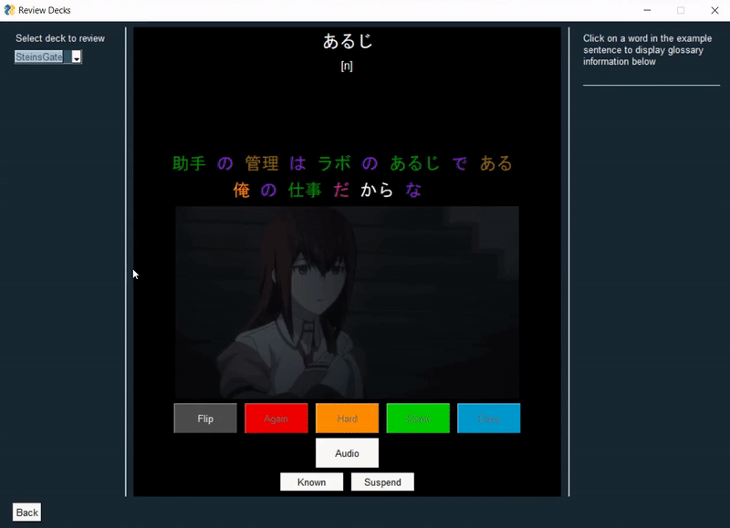

# SubScope
SubScope is a Python application to help with learning Japanese by creating flashcards from video and audio materials.
The aim of the app is to support learning of Japanese by using native content which is broken down into frequently occurring words, to make it more approachable.

	

# Features
- Parse Japanese subtitle files into individual words with glossary information using the Ichitan parser (https://github.com/tshatrov/ichiran)
- Retime subtitle files to match to audio
- Generate flash cards from video and subtitle files
  - Creates a deck of flashcards based on the selected content, and a required comprehension percentage
  - Prioritises words which appear more frequently across the input media
  - Uses the subtitle timestamps to create an audio clip and screenshot for each flash card
  - Provides example sentences for each card, with each word clickable to show glossary information
  - Manages card review interval using a Spaced Repetition System (SRS) to aid memorisation
- Import known words lists from Anki
